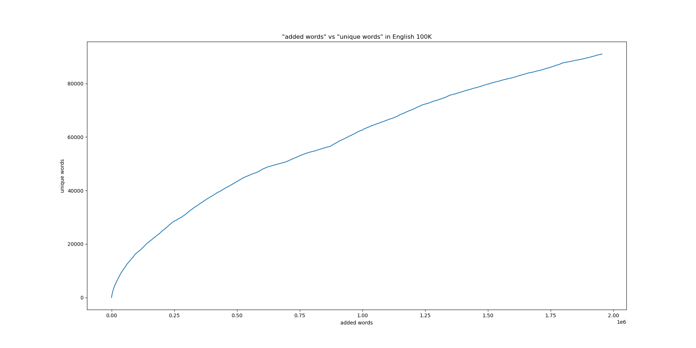

**Mini-project report**
Medlemmar: Filip Ström, Isabel Silva Henriksson, Joakim Forsberg, Miliam Eliasson

Program: Civilingenjörsprogrammet i Teknisk Matematik

Kurs: 1DV501

Inlämningsdatum: 

**Introduktion**
Projektet är uppdelat i fem delar som alla utgår ifrån egengjorda hashing och binary search tree program. Projektet börjar med uppgiften "Count unique words 1" som går ut på att, med hjälp av pythons set-klass, hitta antalet unika ord i två olika filer med ord. Man ska också, med hjälp av dictionary-klassen, ta fram de tio mest frekventa orden som har fyra eller mer bokstäver i samma filer. 

I del två skulle man man bygga ett hashing-set och en binary search tree-map från ett givet skelett. 
Skeletten innehöll de olika funktionerna man skulle ändra för att få en fungerande klass. Man fick också ett output-exempel för att se hur outputen skulle se ut när man körde klasserna i ett program.

I del tre skulle man använda sitt hash-set och sin bst-map förr att göra samma sak som i del ett. Man skulle räkna antalet unika ord i de två textfilerna med sitt hash-set. Sedan skulle man printa de tio vanligaste orden i filerna som var fyra tecken eller längre med sin binary search tree-map. Sedan skulle man göra två nya saker, man skulle printa den maximala storleken på "buckets" efter man fört in orden i hash-settet, och man skulle printa det absoluta djupet i sitt binary search tree efter orden förts in.

I del fyra skulle man importera mathplotlib, som används för att rita grafer, för att rita två olika grafer, varav två av varje (en för varje fil). Den första grafen är ett histogram som visar hur många ord det finns i filerna för olika längder på orden där antalet ord är y-axeln och längderna är x-axeln.
Den andra grafen är ett linjediagram som visar hur många ord som lagts till i ens hash-set och hur många av orden som är unika där antalet ord är x-axeln och unika ord är y-axeln.

I den sista delen, den femte, mäter man tiden på mätningar i klasserna. Först i binära sökträdet, där tar man tre olika storlekar på trädet och söker igenom trädet lika många gånger i varje storlek på trädet för att se hur tiden påverkas (Linjärt? logaritmiskt? exponentiellt? m.m).
Med information man fått gör man två olika grafer, en som visar söktiden per storlek på träd, och en som visar djupet på trädet mot trädets storlek.
Den andra delen av del fem för uppgiften är att kolla hur lång tid det tar att lägga till nya element i sitt hash-set och hur rehashing påverkar denna tid. Sedan ska man även kolla "bucket"-djupet. 
Man ska använda informationen för att rita grafer på tiden det tar att lägga in en viss mängd element (en större mängd) och hur set-storlekar påverkar detta genom rehashing. Man ska även rita en graf som visar hur "bucket"-djupet påverkas av setstorlekar.


**Part 1**
Assignment 3 gav oss följande data: 
Filen "holy_grail" består av 11271 ord, och filen "eng_news_100K-sentences" består av 1953665 ord.

En del av uppgiften var att presentera båda texternas 10 mest använda ord av längd 4 eller längre. För att uppnå detta använde vi oss av metoden:

def most_common(dct, n):
    items = list(dct.items())
    valueSorted = (sorted(items, key=get_value))[::-1]
    for k, v in valueSorted[:n]:
        print(k, "    \t", v)

Här är "dct" en dictionary av alla unika ord, vars tillhörande värden är antalet förekomster i filen. "n" är antalet ord som ska presenteras, vilket i detta fall är 10. Följande kod skapar en lista ur "dct", och skapar sedan en lista till där objekten sorteras efter storleken av det tillhörande värdet, det vill säga i fallande ordning. Detta gav oss informationen:

"holy_grail" består av 1965 unika ord, där de vanligaste orden är följande:
"arthur", "launcelot", "knight", "galahad", "father", "bedevere", "knights", "guard", "robin", och "right".

"eng_news_100K-sentences" består av 91066 unika ord, där de vanligaste orden är följande: 
"their", "about", "there", "would", "people", "which", "after", "years", "first" and "other.

**Part 2**
Uppgiften i uppgift 2 var att återskapa set-klassen och dictionary-klassen med hjälp av hash-set och binära sökträd, för att sedan använda denna grund till uppgift 3. Sökträdet är uppbyggt av noder som besitter information för nästkommande noder på höger och vänster sida, samt ett egenvärde. Vidare måste kod implementeras för rehashing, vilket innefattar att ett hashset klonas och fördubblas i längd för att ge plats för fler objekt om det saknas plats.

För att lägga till objekt i vårt hash-set konstruerade vi en metod vi kallar "add". 
Innan tillägget av det nya objektet jämför metoden listans längd med antalet icke-tomma 
buckets. Om dessa stämmer överens krävs rehashning för att ge plats till det nya objektet. 
Metoden "rehash()" 
När det finns utrymme avgörs positionen av en annan funktion, "get_hash()". I denna 
funktion finns en lista med fyrsiffriga primtal som används för att ge varje objekt ett unikt värde för
att fördela listan maximalt. 

def add(self, word):
        length = len(self.buckets)
        if self.size == length:
            self.rehash()
        position = self.get_hash(word) % length
        if word not in self.buckets[position]:
            self.buckets[position].append(word)
            self.size += 1

## Part 3: Count unique words 2

Vi använde oss av hash-set och bst-map för att göra del ett på ett annat sätt. Vi räknade ut antalet unika ord i de två textfilerna med hjälp av hash-set.

```python
def make_HashSet(lst):
    hash_set = hs.HashSet()
    hash_set.init()
    for e in lst:
        hash_set.add(e)
    return hash_set

hash_set.size()
```
 Sedan printade vi de tio vanligaste orden i filerna som var fyra tecken eller längre med sin binary search tree-map. 

```python
 def most_common(bist, n):
    word_tuples = bist.as_list()
    valueSorted = (sorted(word_tuples, key=lambda word: word[1]))[::-1]
    for k, v in valueSorted[:n]:
        print(k, "    \t", v)
```

 Efter det så printade vi maximala storleken på "buckets", genom att föra in orden i hash-settet, och det absoluta djupet i binary search tree efter att orden förts in.

 ```python
    print("Hash set size:", hash_set.get_size())
    print("Max bucket size:", hash_set.max_bucket_size())
 ```


**holy grail words**-------------------------**english news words**             

|most common words   | count    |most common words | count|
|:------------------:|:-----:|:------------------:|:-----:|
| arthur             | 261| their           |6143|
|launcelot           | 101| about            |4606|
|knight              | 84 |there            |3926|
|galahad             | 81 |would            |3877|
|father              | 74 |people           |3799|
|bedevere            | 68 |which            |3571|
|knights             | 65 |after            |3014|
|robin               | 58 |years            |2984|
|guard               | 58 |first            |2887|
|right               | 57 |other            |2754|


holy grail unique word count: 1365
english news unique word count: 80999 


| | Holy grail     |English news |
|:------------------:|:---------:|:---------:|
| unique words            | 1365| 80999           |
|   max bucket size        | 5|      8       |
| max Bstmap depth              | 23 | 41          |

## Part 4: Plotting

I del fyra skulle man importera mathplotlib, som används för att rita grafer, för att rita två olika grafer, varav två av varje (en för varje fil). Den första grafen är ett histogram som visar hur många ord det finns i filerna för olika längder på orden där antalet ord är y-axeln och längderna är x-axeln.

```python
    plt.bar(lstx, lsty)
    plt.xticks(lstx, lstx)  # Give each position a label
    plt.title('words per wordlength for ' + string)
    plt.xlabel("word length")
    plt.ylabel("word count")
    plt.show()
```

Den andra grafen är ett linjediagram som visar hur många ord som lagts till i ens hash-set och hur många av orden som är unika där antalet ord är x-axeln och unika ord är y-axeln.

```python
    plt.plot([n for n in range(len(lsty))], lsty)
    plt.title('"added words" vs "unique words" in ' + title)
    plt.xlabel("added words")
    plt.ylabel("unique words")
    plt.show()
```


